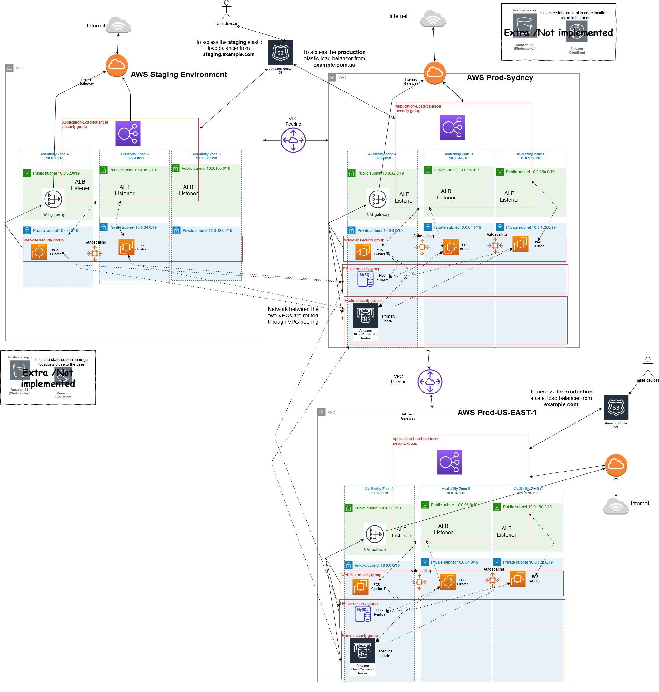
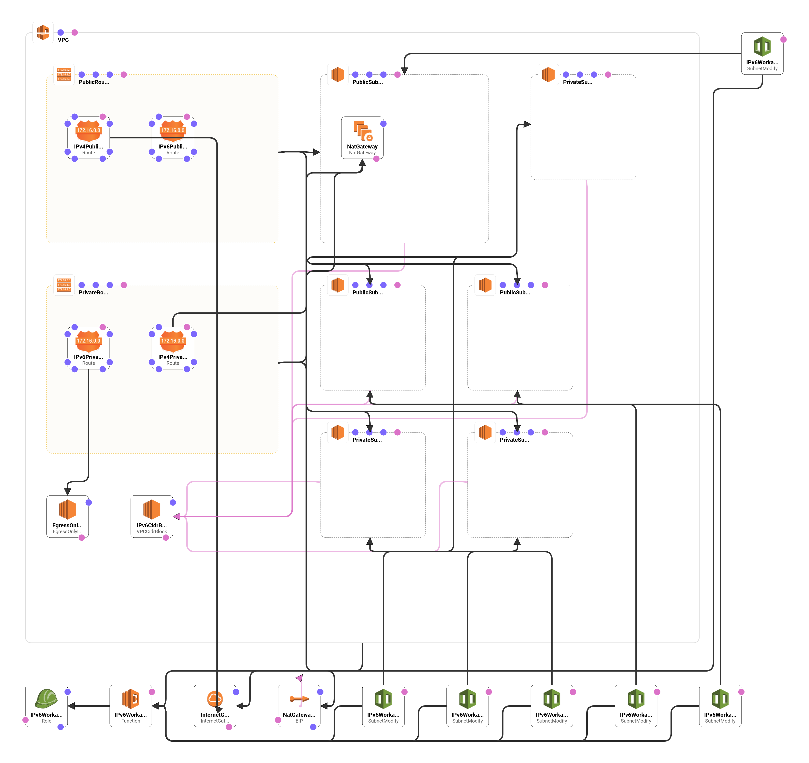

# Deploying a multi-environment and multi-region 3-tier dockerised application with AWS Cloudformation (Work In Progress)

This repository provides a set of YAML templates and linux shell scripts for deploying a 3-tier dockerised application to [Amazon EC2 instances](https://aws.amazon.com/ec2/) using [ECS](https://aws.amazon.com/ecs/).

This is a modified project of my aws-infrastructure repository: https://github.com/Klezca/aws-infrastructure

A simple CI workflow using CodePipeline and Codebuild: https://aws.amazon.com/quickstart/architecture/cicd-taskcat/
has been deployed in AWS and automatically perform **functional testing and linting checks** on the cloudformation templates using the **TaskCat** configuration described in the **.taskcat.yml** file. The CI workflow will automatically merge the **test branch into master** if all the tests passes.

## Overview

## Templates

### Categories

- [Root](#root)
- [VPC](#vpc)
- [Security Groups](#sg)
- [Storage](#storage)
- [WebServer](#webserver)

### Root

[Back to Top](#overview)

This is the master template that will call all the templates.
These are good to build out a full environment without having to run each template individually.
Coupled with a custom parameters JSON file can give you a one command solution to a complex setup and eliminate the need to duplicate code.

<table width="100%">
    <tr>
        <th align="left" colspan="2"><h4><a href="https://github.com/klezca/aws-infrastructure/blob/master/root.yaml">Infrastructure</a></h4></th>
    </tr>
    <tr>
        <td width="100%" valign="top">
            
Select the foundational pieces for building out an infrastructure from the ground up.

            <h6>Create Details</h6>
            <ol>
                <li>VPC</li>
                <li>Storage</li>
                <li>Web Server</li>
            </ol>
        </td>
        <td  nowrap width="200" valign="top">
            <table>
                <tr>
                    <th align="left">View Diagram</th>
                </tr>
                <tr>
                    <td>
                        
                    </td>
                </tr>
            </table>
        </td>
    </tr>
</table>

### VPC

[Back to Top](#overview)

<table width="100%">
    <tr>
        <th align="left" colspan="2"><h4><a href="https://github.com/klezca/aws-infrastructure-2/blob/master/templates/vpc/vpc.yaml">VPC</a></h4></th>
    </tr>
    <tr>
        <td width="100%" valign="top">
            
Select the foundational pieces for building out a dualstack IPv4/IPv6 VPC network from the ground up.

            <h6>Create Details</h6>
            <ol>
                <li>VPC</li>
                <li>IPv6 Cidr Block</li>
                <li>Internet Gateway</li>
                <li>Egress Internet Gateway</li>
                <li>NAT Gateway</li>
                <li>3 Public Subnets</li>
                <li>3 Private Subnets</li>
                <li>Public/Private Route Table</li>
                <li>Security Groups</li>
                <li>IPv6 workaround IAM role and Lambda with python runtime</li> 
            </ol>
        </td>
        <td  nowrap width="200" valign="top">
            <table>
                <tr>
                    <th align="left">View Diagram</th>
                </tr>
                <tr>
                    <td>
                        
                    </td>
                </tr>
            </table>
        </td>
    </tr>
</table>

### Security Groups

[Back to Top](#sg)

<table width="100%">
    <tr>
        <th align="left" colspan="2"><h4><a href="https://github.com/klezca/aws-infrastructure-2/blob/master/templates/vpc/security-group.yaml">VPC</a></h4></th>
    </tr>
    <tr>
        <td width="100%" valign="top">
            
Select the foundational pieces for building out the necessary security groups.

            <h6>Create Details</h6>
            <ol>
                <li>Web Server Security Group</li>
                <li>Load Balancer Security Group</li>
                <li>MySQL RDS Security Group</li>
                <li>Redis Elasticache Security Group</li>
            </ol>
        </td>
        <td  nowrap width="200" valign="top">
            <table>
                <tr>
                    <th align="left">View Diagram</th>
                </tr>
                <tr>
                    <td>
                        
                    </td>
                </tr>
            </table>
        </td>
    </tr>
</table>

### Storage

[Back to Top](#overview)

<table width="100%">
    <tr>
        <th align="left" colspan="2"><h4><a href="https://github.com/klezca/aws-infrastructure/blob/master/infrastructure/storage.yaml">Storage</a></h4></th>
    </tr>
    <tr>
        <td width="100%" valign="top">
            
Select the foundational pieces for building out the storage from the ground up.

            <h6>Create Details</h6>
            <ol>
                <li>KMS key</li>
                <li>Aurora cluster</li>
                <li>Elasticache cluster</li>
                <li>Aurora Alarms</li>
            </ol>
        </td>
        <td  nowrap width="200" valign="top">
            <table>
                <tr>
                    <th align="left">View Diagram</th>
                </tr>
                <tr>
                    <td>
                        
                    </td>
                </tr>
            </table>
        </td>
    </tr>
</table>

### WebServer

[Back to Top](#overview)

<table width="100%">
    <tr>
        <th align="left" colspan="2"><h4><a href="https://github.com/klezca/aws-infrastructure/blob/master/infrastructure/webserver.yaml">Web Server</a></h4></th>
    </tr>
    <tr>
        <td width="100%" valign="top">
            
Select the foundational pieces for building out a web server, application load balancer, autoscaling groups and a route 53 record for the application load balancer from the ground up.

            <h6>Create Details</h6>
            <ol>
             <li>EC2 Launch Configuration</li>
             <li>Autoscaling group</li>
             <li>Application load balancer</li>
             <li>Route 53 A record for application load balancer</li>
            </ol>
        </td>
        <td  nowrap width="200" valign="top">
            <table>
                <tr>
                    <th align="left">View Diagram</th>
                </tr>
                <tr>
                    <td>
                        
                    </td>
                </tr>
            </table>
        </td>
    </tr>
</table>
